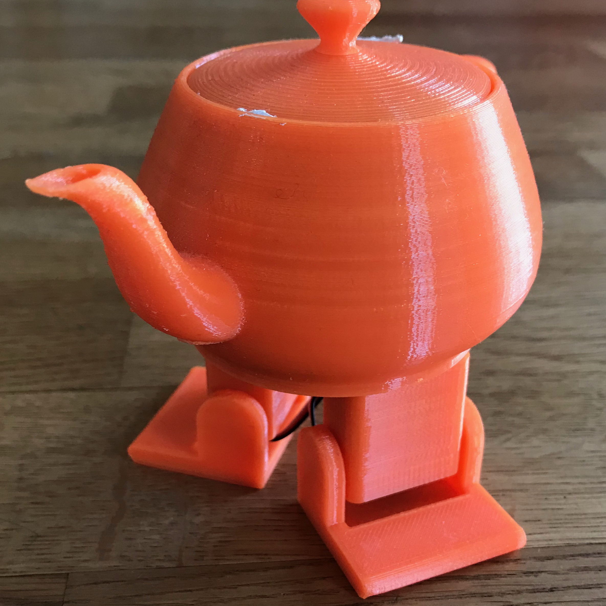
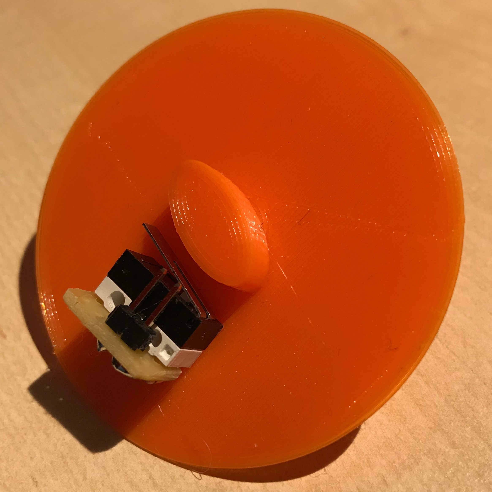
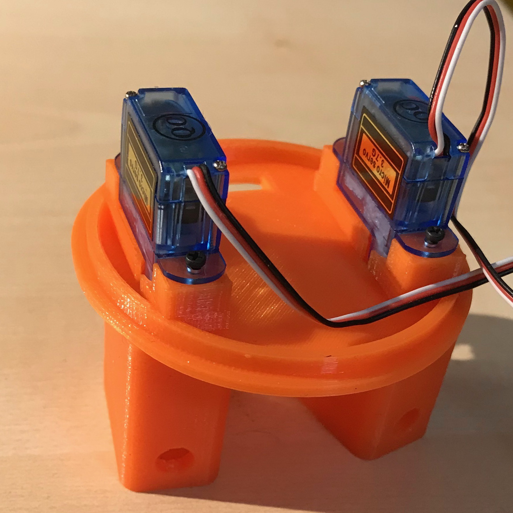
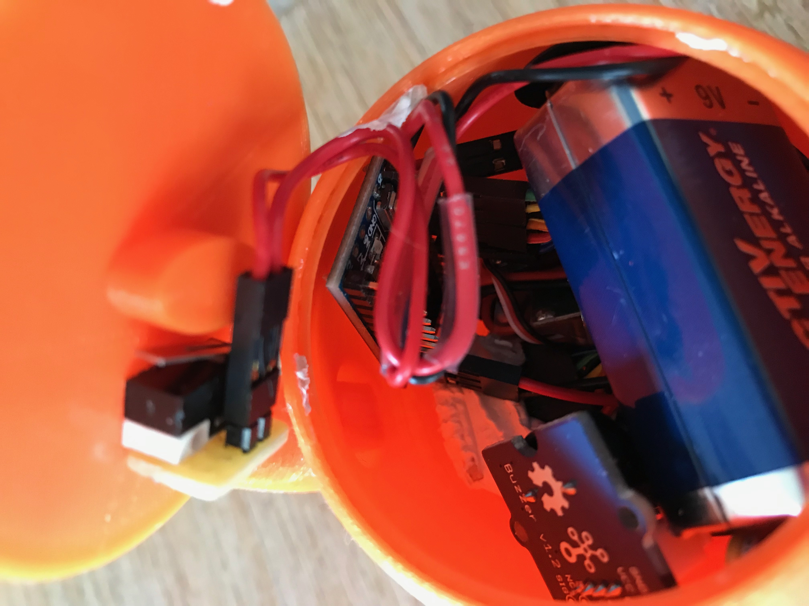

# Dancing Teapot Bot

The dancing teapot is inspired by [Paul-Louis Ageneau](https://chapelierfou.org/blog/plasteac-a-dancing-teapot.html). During my computer graphics courses, I implemented different shading algorithms using the [Utah teapot 3D model](https://en.wikipedia.org/wiki/Utah_teapot) and the main color was orange.

<figure>

<figcaption>From left to right: Lid with switch, the hip servos connected to the legs, a bit squeezed inside the teapot.</figcaption>
</figure>

<figure>
<figcaption>
The hip servos.
</figcaption>
</figure>

## Links

* [Plasteac: a dancing teapot](https://chapelierfou.org/blog/plasteac-a-dancing-teapot.html)
* [Paul-Louis Ageneau (GitHub)](https://github.com/paullouisageneau/plasteac)
